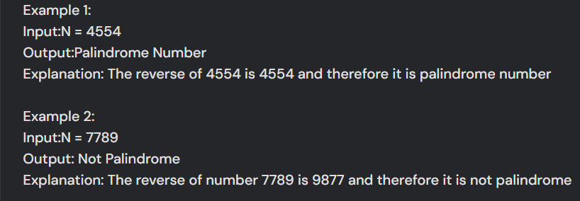

```java
public class Main
{
	public static void main(String[] args) {
		int n = 4554;
		int temp = n;
		int reversed = 0;
		
		while(temp > 0) {
		    int lastDigit = temp % 10;
		    reversed = (reversed * 10) + lastDigit;
		    temp = temp / 10;
		}
		
		if(n == reversed) {
		    System.out.print("Yes");
		}
		else {
		    System.out.print("No");
		}
		
	}
}
```