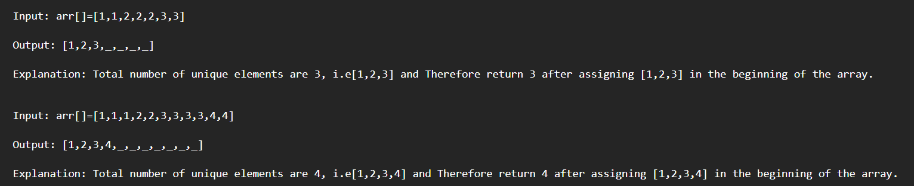

```java 
import java.util.*;
public class Main
{
	public static void main(String[] args) {
		int arr[] = {1, 1, 3, 3, 5, 5};
        removeDuplicates(arr);
	    for(int i : arr) {
            System.out.print(i + " ");
        }
	}

    public static void removeDuplicates(int arr[]) {
        int n = arr.length;
        int j = 0; // Last Unique element
        for(int i = 1; i < n; i++) {
            if(arr[j] != arr[i]) {
                j++;
                arr[j] = arr[i];
            }
        }

        for(int i = j + 1; i < n; i++) { //filling zeros
            arr[i] = 0;
        }
    }
}
```