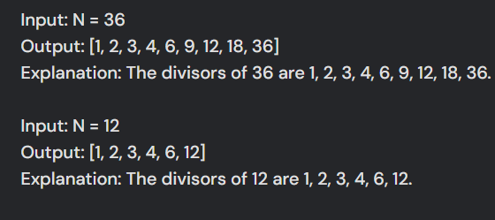
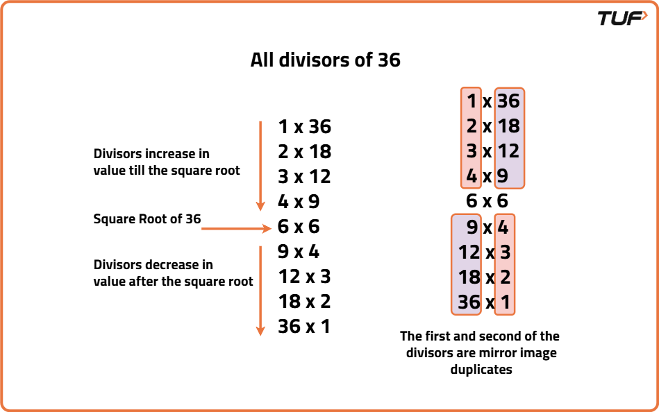

```java
import java.util.*;
public class Main
{
	public static void main(String[] args) {
		int n = 36;
		ArrayList<Integer> arr = new ArrayList<>();
		for(int i = 1; i * i <= n; i++) {
		    if(n % i == 0) {
		        arr.add(i);
		        if(n / i != i) {
		            arr.add(n / i);
		        }
		    }
		}
		Collections.sort(arr);
		System.out.println(arr);
	}
}
```